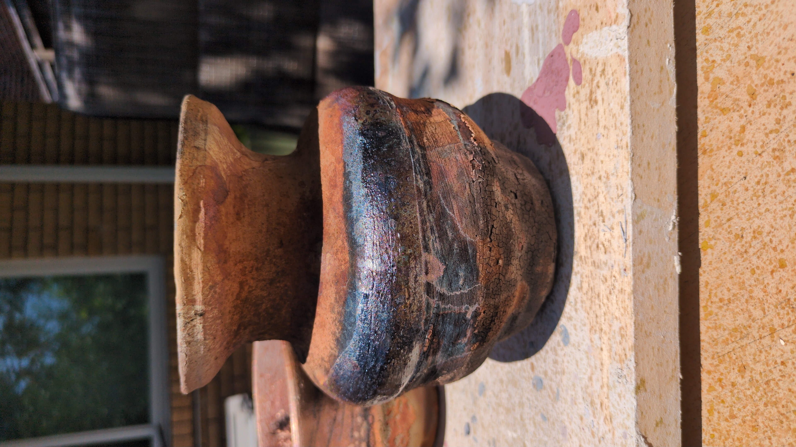

Other than mathematics, I sometimes make ceramic artwork. I'm particularly fond of playing with alternative firing methods. Here's some of the pieces I've made. To see more go [here](www.clutskoart.com)

